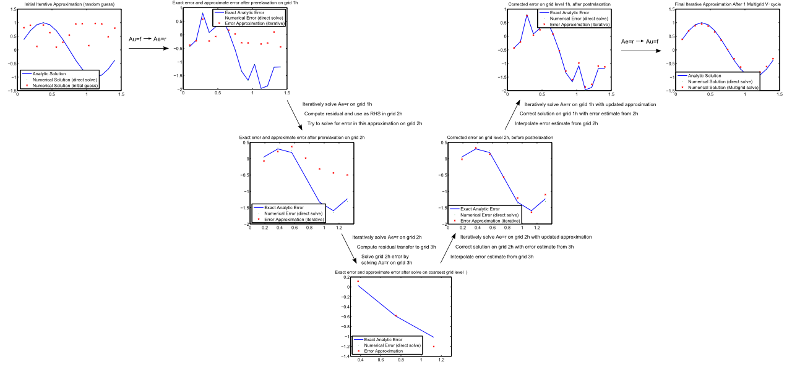

# MultiGridMatlab

The purpose of this repository is to provide Matlab code for geometric multigrid that is easy to understand and learn from. It is perfect for students because it was written by a graduate student.

Start with the  to understand how multigrid works. This is ideal for the beginner to walk through, with visualizations every step of the way.

Writting or enhancing a code like  would make a great class project. Perhaps extend 2D to 3D for a short assignment, write in another language, or add some advection for more difficulty.

This short  explains the math behind the code.

